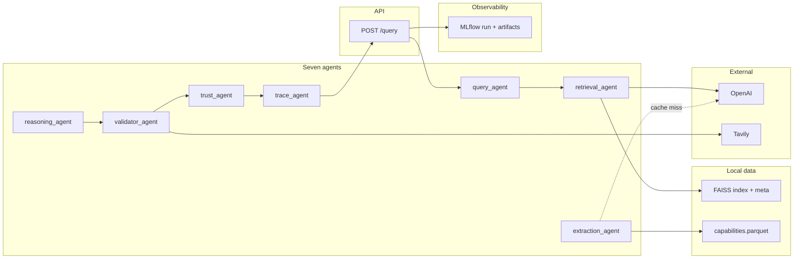
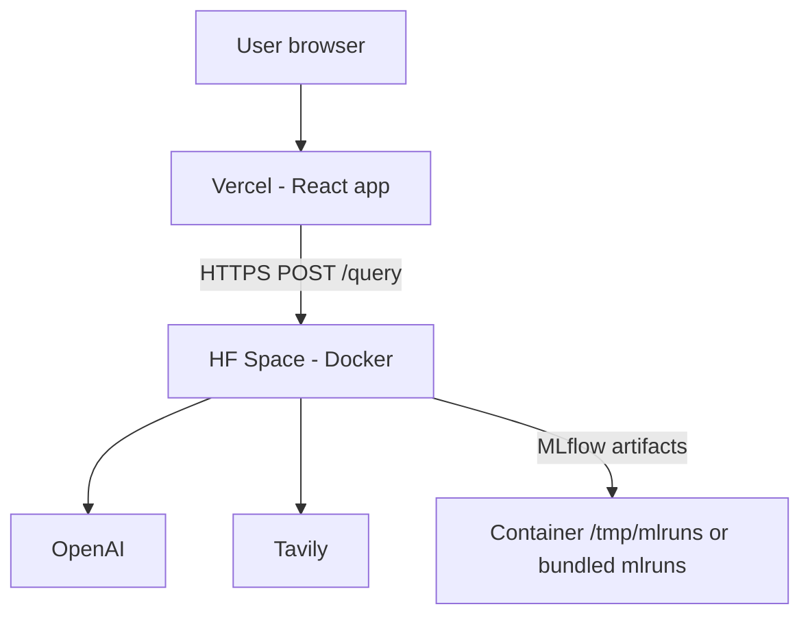

# Tech stack & architecture (pre-Databricks / FAISS version)

This document describes the **original production path**: local Parquet + **FAISS** vector search, **OpenAI** for embeddings and chat, **MLflow** for experiment traces, **FastAPI** on **Hugging Face Spaces**, and a **Vite/React** frontend on Vercel. It does **not** describe the optional `USE_DATABRICKS=1` path (Mosaic Vector Search, Databricks Model Serving, UC Delta).

---

## 1. Tech stack (at a glance)

| Layer | Technology | Role |
|-------|------------|------|
| **API** | FastAPI + Uvicorn | `POST /query`, `GET /health`, `GET /desert-map`, `GET /desert-map/pins` |
| **Orchestration** | Python `orchestrator.py` | Runs the seven agents in order inside one MLflow run |
| **LLM & embeddings** | OpenAI API (`gpt-4o-mini`, `text-embedding-3-small`) | Parsing, extraction, ranking prose, optional validator LLM; dense vectors for retrieval |
| **Vector search** | FAISS (`faiss-cpu`, cosine via L2-normalized inner product) | Top-K similarity over hospital **notes** |
| **Structured data** | Pandas + Parquet | Canonical facilities, metadata beside vectors, pre-extracted capabilities cache |
| **Web validation** | Tavily | Fetches short “medical standards” snippets for the validator agent |
| **Observability** | MLflow (tracking URI = `./mlruns` or `/tmp/mlruns` on HF) | One run per query; step JSON artifacts + optional span-style trace tree |
| **Deploy (backend)** | Hugging Face Spaces (Docker) | Image bundles code + `data/` (parquet + FAISS index) |
| **Deploy (frontend)** | Vercel + React/Vite | Calls backend via `VITE_BACKEND_URL` |
| **Secrets** | HF Space variables, local `.env` | `OPENAI_API_KEY`, `TAVILY_API_KEY`, `CORS_ORIGINS` |

---

## 2. Data artifacts (offline pipeline)

Everything below is produced **before** serving traffic (or refreshed when the dataset changes).

1. **Ingest** (`scripts/01_ingest.py`): reads the Virtue Foundation **XLSX** → canonical **Parquet** (`data/processed/hospitals.parquet`) with stable columns: `facility_id`, geo, `phone`, `email`, merged **`notes`** (description, specialties, equipment, etc.).
2. **Embed + index** (`backend/pipeline/embed.py`): embeds each row’s `notes` with OpenAI → builds **FAISS** `IndexFlatIP` + sidecar **`faiss_meta.parquet`** (same row order as index vectors).
3. **Batch extract** (`scripts/02_extract_all.py` / `pipeline/batch_extract.py`): optional but recommended — runs the extraction prompt over many rows and writes **`data/extracted/capabilities.parquet`** so online queries are mostly **cache hits** instead of live LLM calls.

At runtime the API **does not** re-embed the full corpus; it only embeds the **user query** for retrieval.

---

## 3. Request lifecycle (one `POST /query`)

High-level flow — all of this is in `backend/orchestrator.py`, wrapped by `mlflow_setup.query_run(query)`.

| Step | Agent | What happens |
|------|--------|----------------|
| 1 | **query_agent** | Natural language → structured `ParsedQuery` (state, district, rural flag, required capabilities, free-text constraints). |
| 2 | **retrieval_agent** | Embeds query → FAISS top-K on **notes** → applies **structured filters** (e.g. state, rural) → returns a small candidate `DataFrame`. |
| 3 | **extraction_agent** | For each candidate: **lookup** `capabilities.parquet` by `facility_id`; on miss, **live** LLM extraction from `notes`, then optionally **append** to cache. |
| 4 | **reasoning_agent** | Scores how well capabilities match the parsed query (multi-attribute, not keyword-only). |
| 5 | **validator_agent** | Rule engine + optional Tavily-backed standards text; emits **issues** (e.g. surgery without anesthesiologist). |
| 6 | **trust_agent** | Combines completeness, consistency, validator, evidence strength → **trust score** + flags + **trust_breakdown** for the UI. |
| 7 | **trace_agent** | Short human-readable line per top result for transparency. |

**Ranking**: top facilities are ordered by a blend of **capability match** and **trust** so a well-evidenced hospital can beat one that only claims more on paper.

**Response shape**: each `HospitalResult` includes **evidence** (verbatim snippets from notes), **reasoning**, **validator context** (via trace), **phone/email** when present in Parquet, and **trust_breakdown**.

---

## 4. Analytics routes (desert / crisis)

- **`GET /desert-map`**: aggregates pre-extracted capability columns **by state** from `capabilities.parquet` (gap ratios).
- **`GET /desert-map/pins`**: joins extractions with **`hospitals.parquet`** on `facility_id`, groups by **PIN**, computes risk = fraction `no`/`uncertain` on a chosen capability, returns centroid lat/lng for mapping.

No vector DB call is required for these endpoints — they are **SQL-like aggregations in Pandas** over Parquet.

---

## 5. Deployment topology

- **Backend** reads only **local files** under `data/` shipped in the Space image (via `deploy_hf.ps1` which LFS-pushes parquet + FAISS).
- **CORS** on FastAPI must list the Vercel origin.
- **Frontend** sets `VITE_BACKEND_URL` to the Space URL (e.g. `https://<user>-healthmap-agent.hf.space`).

---

## 6. Talk track (2–3 minutes) — use as a script

You can read this verbatim or shorten it for a demo.

> “We built **Healthmap Agent** for roughly ten thousand Indian healthcare facilities. The data is messy free text — equipment lists, claims about 24/7 care, specialties — so keyword search isn’t enough.
>
> **Technically**, we use a **FastAPI** service deployed on **Hugging Face Spaces**. The heavy lifting is a **seven-agent pipeline** orchestrated in Python. First we **parse** the user’s question into structured location and capability requirements. Then **retrieval** isn’t Elasticsearch — we embed the query with **OpenAI**, search a **FAISS** index built over each facility’s consolidated **notes**, and filter by state and rural flags so results stay geographically honest.
>
> For each candidate we **extract** structured capabilities — ICU, emergency, surgery, anesthesiology, oxygen, and staffing — using a **conservative** LLM policy: if it isn’t explicit in the text, we mark **uncertain**, not yes. Most of the time we read precomputed rows from a **Parquet** cache so we’re not paying for extraction on every request.
>
> A **validator** layer applies **medical rules** — for example surgery should not score well without anesthesia — and can pull short **standards** snippets from the web via **Tavily**. A **trust scorer** blends evidence strength, internal consistency, and validator outcomes into a single score with a breakdown the UI can show.
>
> **Observability**: every query opens one **MLflow** run with step artifacts — parsed intent, retrieval IDs, extractions, validator output, final ranking — so judges or clinicians can audit the chain.
>
> The **frontend** on **Vercel** calls this API and shows citations, trust, and optional **PIN-level desert** stats from our analytics routes. The whole design is **on-prem friendly** in the sense that the brain is just Python, Parquet, and FAISS — no Databricks dependency on this path.”

---

## 7. Where to look in the repo

| Topic | Path |
|-------|------|
| Pipeline entry | `backend/orchestrator.py` |
| FAISS retrieval | `backend/agents/retrieval_agent.py`, `backend/pipeline/embed.py` |
| OpenAI wrapper | `backend/core/llm.py` |
| Schemas / API models | `backend/core/schemas.py` |
| MLflow helpers | `backend/core/mlflow_setup.py` |
| Ingest + canonicalize | `backend/pipeline/load.py`, `scripts/01_ingest.py` |
| Deploy | `docs/DEPLOY.md`, `Dockerfile`, `scripts/deploy_hf.ps1` |

---

## 8. Contrast with the Databricks path (one sentence)

If you later enable **`USE_DATABRICKS=1`**, FAISS and local Parquet for retrieval are replaced by **Mosaic AI Vector Search** over **Unity Catalog Delta**, chat/embeddings move to **Databricks Model Serving**, MLflow tracking targets the **Databricks** workspace, and desert endpoints can aggregate via **SQL warehouse** — the **orchestrator and agent contracts stay the same**, only the data and model planes swap.
